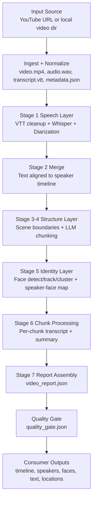

# Vidsect Project Overview

## What This Project Does

Vidsect takes a long video (usually a YouTube livestream), analyzes speech and visuals,
then produces a structured report that answers:

- what happened over time (chunk timeline)
- who spoke, when, and for how long
- which face identity maps to which speaker
- what locations are mentioned (with strict extraction rules)
- per-chunk summary text and full chunk transcript

Primary output:

- `analysis/video_report.json`

## How It Achieves This

The system is a staged pipeline where each stage writes checkpoints and debug artifacts.
Later stages reuse prior outputs, so reruns are fast unless a stage is invalidated.

1. Ingest:
- Downloads best available YouTube video+audio and subtitles.
- Normalizes files to `video.mp4`, `audio.wav`, `transcript.vtt`, `metadata.json`.

2. Speech understanding:
- Cleans VTT captions.
- Runs Whisper transcription for timestamped text.
- Runs pyannote diarization for speaker segments.
- Merges transcript + speaker timeline.

3. Structure understanding:
- Detects visual scene boundaries.
- Uses local LLM to create semantic chunks from transcript + scenes.

4. Identity mapping:
- Detects/tracks faces.
- Clusters face tracks into person identities.
- Maps speakers to person identities.
- Exports representative face images.

5. Chunk-level packaging:
- Builds per-chunk transcript and summary.
- Adds speaker/face mapping and location extraction.
- Produces one consolidated `video_report.json`.

6. Quality control:
- Runs a quality gate and emits `analysis/debug/quality_gate.json`.
- In strict mode, fallback behaviors fail the run.

## Pipeline Visual (Medium Detail)

## Why This Design Works

- Separation of concerns: each stage solves one task well.
- Recoverability: stage checkpoints allow resume without reprocessing everything.
- Explainability: debug artifacts preserve intermediate decisions.
- Production safety: strict mode rejects low-trust fallback outputs.
- Extensibility: each stage can be upgraded without rewriting the entire pipeline.
